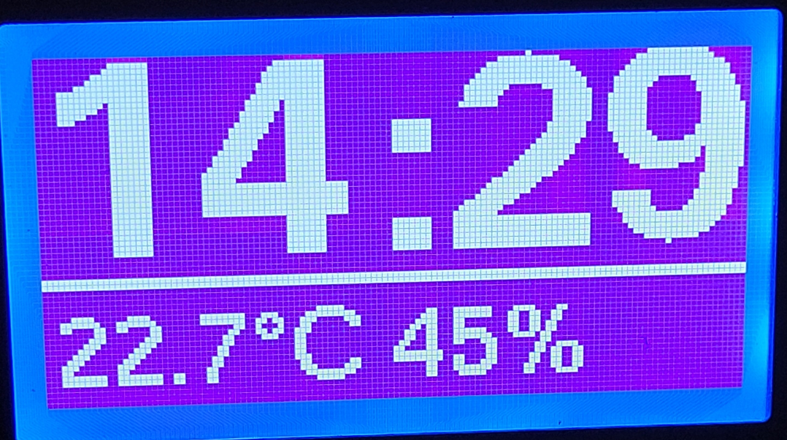

# Air-Quality-Clock

An LCD12864 is used as the display. 

I have the following functions for the clock internet radio: 

- Display of the time in large letters
- Display of temperature, humidity and air pressure
- Display of air quality (IAQ, CO2 and VOC)
- Control of the display background depending on the brightness
- Update the software via OTA

